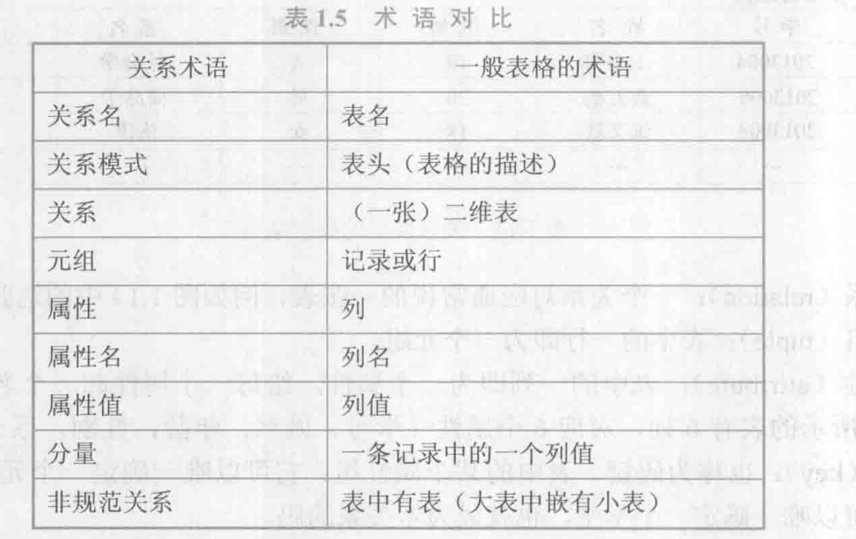
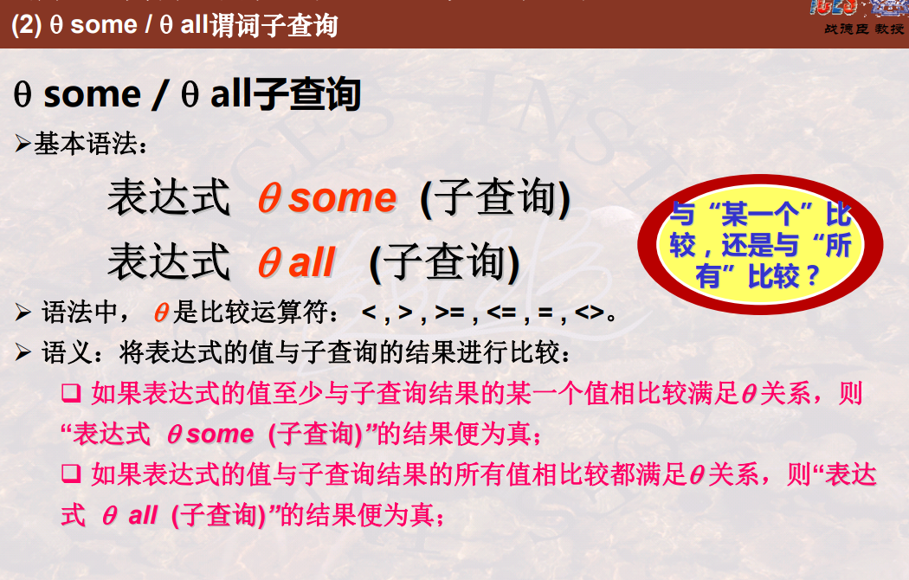
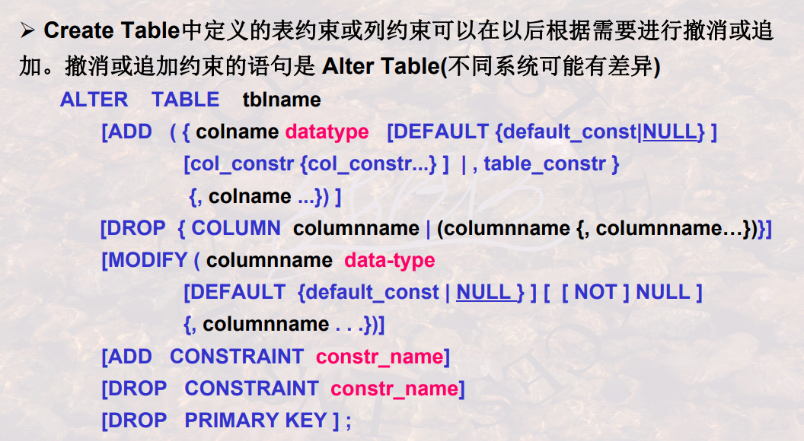
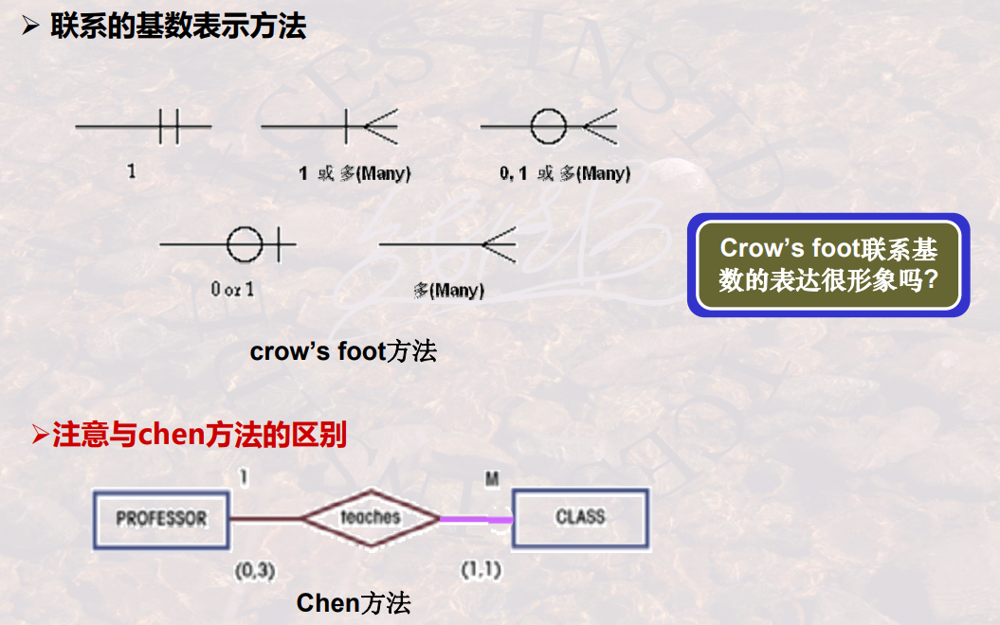
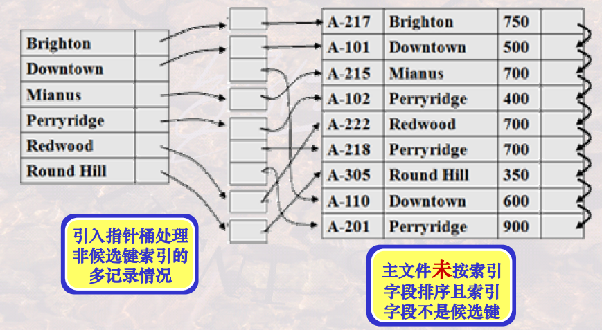
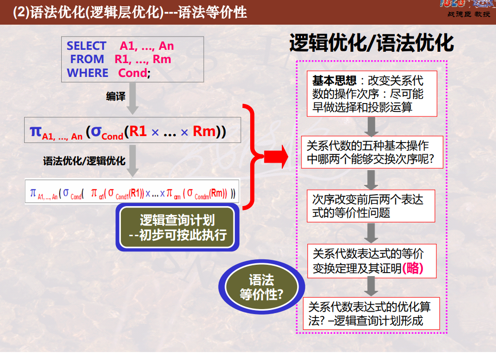
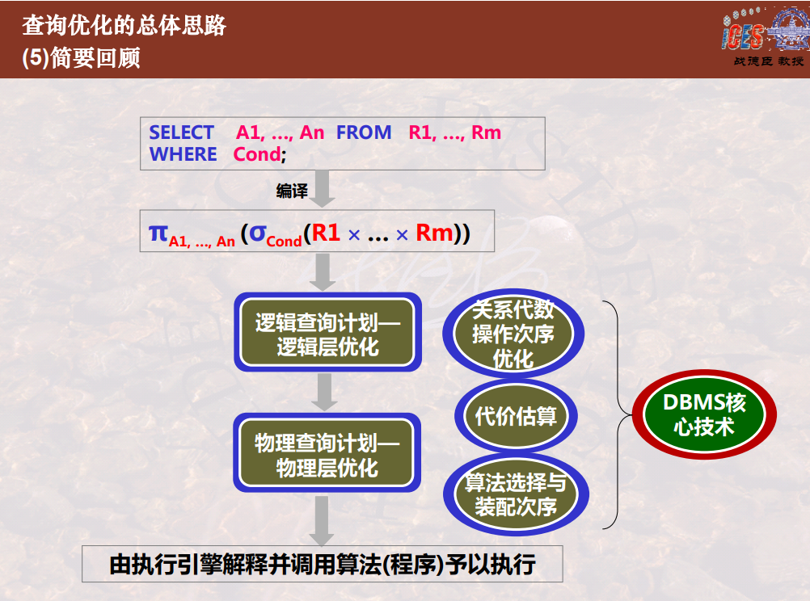
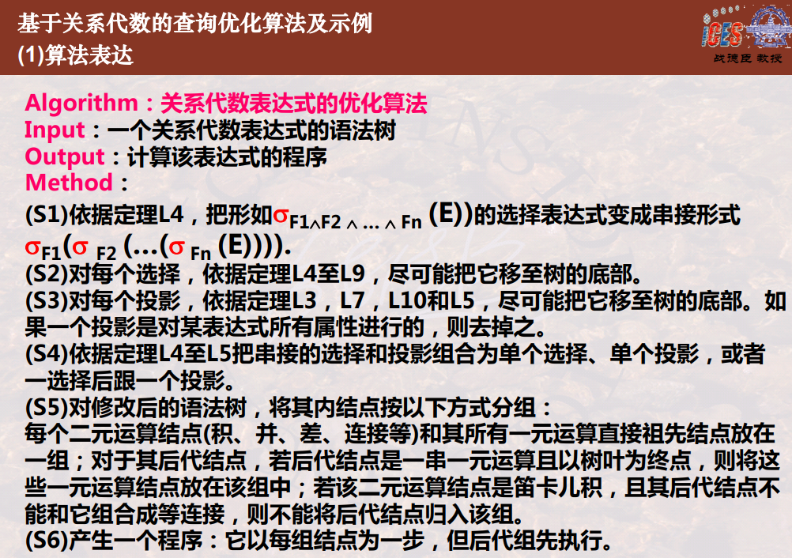
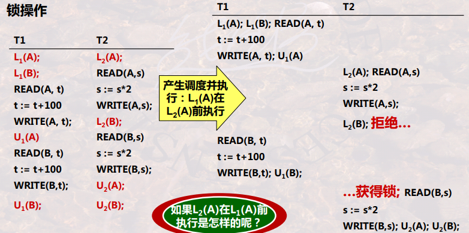

   

# 第一章 绪论

## 1.1 数据库系统概述

### 数据库课程的学习内容


### 数据库的4个基本概念：

1. 数据：**描述事物的符号记录称为数据。**数据的含义成为数据的语义，数据与其语义是不可分割的。

2. 数据库：**数据库是长期存储在计算机内、有组织、可共享的大量数据的集合。**数据库中的数据按一定的数据模型组织、描述和存储，具有**较小的冗余度**(Redundancy)、**较高的数据独立性**和**易扩展性**(scalability)，并可为各种用户共享。

3. 数据库管理系统：**数据库管理系统是位于用户和操作系统之间的一层数据管理软件。**其主要功能有：

   * **数据定义**,Data Definition Language DDL
   * 数据组织、存储和管理 ，Data
   * **数据操纵功能** Data Manipulation Language ,DML 即增删改查
   * 数据库的事务管理和 运行管理
   * 数据库的建立以及维护

   > 常见的DBMS有：MySQL ，Oracle , SQL Server等
   >
   > 通俗的说就是：通过SQL语言来操纵管理数据库的软件系统
   >
   > 
   >
   > DBMS的执行流程:先解析语言，然后执行一系列程序 
   >
   > 

4. 数据库系统：**数据库系统是由数据库、数据库管理系统（及其应用开发工具）、应用程序和数据库管理员（DBA : Database Administrator 数据库管理员）组成的存储、管理、处理和维护数据的系统。**

### 数据库的发展演变

1. 人工管理
2. 文件管理
3. 数据库管理
   1. 层次，网状数据库
   2. **关系数据库**
   3. 对象关系数据库，面向对象数据库，xml数据库等...
   4. 多种数据库系统开放互联（ODBC ,JDBC)
   5. 新型数据库（关系数据库+其他新技术）

### 数据库系统的特点： 

1. **数据结构化**
2. **数据共享度高，冗余度低且易扩充**
3. **数据独立性高：**数据独立性包括**物理独立性**和**逻辑独立性**。物理独立性是指**用户的应用程序与数据库中数据的物理存储是相互独立的**。逻辑独立性是指**用户的应用程序与数据库的逻辑结构是相互独立的**。
4. **数据由数据库管理系统统一管理控制：**数据管理系统提供以下数据控制功能：**数据的安全性保护**、**数据的完整性检查**、**并发控制**和**数据库恢复**。

### 工作岗位与学习程度


* 终端用户：简单了解
* 开发程序员：掌握高级语言和SQL语言开发应用程序
* 数据库设计：掌握数据库的模型等
* 数据库管理：数据库的权限，安全等
* DBMS设计：算法等


## 1.2 数据模型

数据模型也是一种模型，他是对现实世界数据特征的抽象，是数据库系统的核心和基础。

### 两类数据模型：

1. 第一类是**概念模型**：也称信息模型，它是按照用户的观点来对数据和信息建模，主要用户数据库设计
2. 第二类是**逻辑模型和物理模型：**
   * 逻辑模型主要包括**层次模型、网状模型、关系模型、面向对象数据模型、对象关系数据模型、半结构化数据模型。**主要用于数据库管理系统的实现
   * 物理模型是对数据最底层的抽象。

#### 概念模型

1. **实体（entity）**：客观存在并可相互区别的事务成为实体

2. **属性（attribute）**：实体所具有的某一特性成为属性

3. **码（key)**：唯一标志实体的属性集成为码

4.  **实体型（entity type) ** :用实体名及其属性名集合来抽象和刻画同类实体，成为实体型

5. **实体集（entity set)**

6. **联系（relationship）**

   > 实体之间的联系有：
   >
   > * 一对一
   > * 一对多
   > * 多对多

概念模型的一种表示方法：实体-联系法（entity-relationship approach) ，该方法用E-R 图来描述现实世界的概念模型

### 数据模型的组成要素

* 数据结构
* 数据操作
* 数据的完整性约束条件

### 常用的数据模型

1. 层次模型：树的形式组织数据
2. 网状模型：网的形式组织数据
3. 关系模型:   表的形式组织数据

### 关系模型

**关系模型** ：所有的模式都可为抽象表（table)的形式

> 模型：用什么形式组织模式。模式：如何表示具体数据的结构。数据：具体信息
>
> **数据**本身结构抽象为**模式**，模式抽象为**模型**



关系模式：对关系的描述，一般表示为 关系名（属性1，属性2，......)

关系模型要求关系是规范的，不可再分

> 关系模型概念严格单一，便于理解和开发；支持集合的操作
>
> 但是存取路径对用户隐蔽，查询效率不高，需要优化

### 数据库系统的结构

三级模式，两级映射

#### 模式：（概念层模式，Conceptual Schema)

模式也称逻辑模式，是数据库中**全体数据的逻辑结构和特征的描述**，是所有用户的公共视图。**一个数据库只有一个模式。**

#### 外模式（子模式,External Schema）：

外模式也称**子模式或用户模式**，他是数据库用户能够看见和使用的**局部数据的逻辑结构和特征的描述**，是数据库用户的数据视图，是与某一应用有关的数据逻辑表示。**一个应用程序只能使用一个外模式。**

> 外模式是用户和程序员看到的部分
>
> Schema描述的是结构，View(视图)是数据的展示

#### 内模式(内部模式，Internal Schema)：

内模式也称存储模式，一个数据库只有一个内模式。他是**数据物理结构和存储方式的描述**，是数据在数据库内部的组织方式。

#### 外模式/模式映像（E-C Mapping ：External Schema-Conceptual Schema Mapping）：

当模式改变时**（如增加新的关系，新的属性，改变属性的数据类型等）**，由数据库管理人员对各个外模式/模式映像做相应改变，可以使外模式保持不变。应用程序是依据数据的外模式编写的，从而应用程序不必修改，保证了数据与程序的逻辑独立性，简称**数据的逻辑独立性。**

#### 模式/内模式映像（C-I Mapping ：Conceptual Schema-Internal Schema Mapping）：

当数据库的存储结构改变时（**例如选用另一种存储结构**），由数据库管理人员对模式/内模式映像做相应改变，可以使模式保持不变，从而应用程序不必改变。保证了数据与程序之间的物理独立性，简称**数据的物理独立性**。


本章总结


# 第二章 关系数据库

##2.1关系数据结构及形式化定义

###关系

**域（domain)** :域是一组具有相同数据类型的值的集合，可以取值的个数叫**基数**

**笛卡尔积** ：一个记录叫做一个**元组**（tuple),元组中每一个属性值，叫一个**分量**

**基数：** 域的元素个数

> 笛卡尔乘积是指在数学中，两个集合*X*和*Y*的笛卡尔积，表示为*X*×*Y*，所有有序对
>
> 假设集合A={a, b}，集合B={0, 1, 2}，则两个集合的笛卡尔积为{(a, 0), (a, 1), (a, 2), (b, 0), (b, 1), (b, 2)}。
>
> 基数为2 x 3=6


**关系：**关系是笛卡尔积的子集，每一行对应一个元组，每一列对应一个域，列名叫做属性（attribute)

​			R是表的名字，n是属性个数，叫做关系的目或度（degree)


**候选码(candidate key)：**某一属性组的值能唯一标识一个元组，而他的子集不能，则称该属性组为**候选码。**

**主码(primary key)：**若一个关系有多个候选码，则选定其中一个为**主码。**

**主属性：**属于候选码的属性叫主属性。其他属性叫非主属性或非码属性

**全码：**若关系模式的所有属性都是这个关系模式的候选码，称为全码。

**外码**：依赖于另一个关系的主码  

#### 关系的三种类型

* **基本关系（基本表/基表）**：实际存在的表
* **查询表**：查询结果对应的表
* **视图表**：是由基本表或其他视图表导出的表，是虚表，不对应实际存储的数据

#### 基本关系的6条性质：

1. 列是同质的。（同一数据类型）
2. 不同的列可以出自同一个域，不同的属性要有不同的属性名
3. 列的顺序无所谓。
4. 任意两个元组的候选码不能取相同的值。
5. 行的顺序无所谓。
6. 分量必须取原子值，每一个分量都不可分。

### 关系模式


或者表示为R(U,D,DOM,F)

> R：关系名。
>
> U：组成该关系的属性名的集合。
>
> D:   U中的属性所来自的域。
>
> DOM：属性向域的映像集合。
>
> F：属性见数据的依赖关系集合。

关系是关系模式在某一时刻的状态或内容

**关系模式是静态的、稳定的，而关系是动态的，随时间不断变化的。**

### 关系数据库

关系数据库的型就是关系数据库模式

关系数据库的值就是关系数据库模式在某一时刻对应的关系的集合


## 2.2关系操作

**特点**：集合操作方式，操作对象和结果都是集合

> 也称为一次一集合的方式，非关系数据库模型的操作方式则成为一次记录的方式 

### 关系数据语言的分类

* 代数方式：**关系代数**，用关系的运算来表达查询要求
* 逻辑方式：**关系演算**，用谓词来表达查询要求
  * 元组关系演算
  * 域关系演算

> 以上三种方式在表达能力上是等价的，都具有完备的表达能力；它们是抽象的查询语言。与实际的查询语言并不完全一样，，但它们能用作评估实际系统中查询语言能力的标准或基础

* 具有关系代数和关系演算双重特点的语言：SQL(Structured Query Language）

 SQL是集查询（DQL),数据定义语言（DDL),数据操纵语言（DML)和数据控制语言（DCL)于一体的关系    数据语言

## 2.3关系的完整性  

关系模型中有三类完整性约束：**实体完整性，参照完整性和用户定义完整性。**

> 前两个是关系模型必须满足的

#### 实体完整性

若属性A是基本关系R的**主属性**，那么A不能取空值。

#### 参照完整性

若属性或属性组F是关系R的**外码，**它与基本关系S的主码K相对应，则对于R中的每个元组在F上的值必须：

1. 或者等于空值（F的每个属性均为空）。
2. 或者等于S中某个元组的主码值。

#### 用户定义完整性

## 2.4 关系代数

关系代数是一种抽象的查询语言，他用对关系的运算来表达查询

**三要素：**运算对象（一种关系），运算符，运算结果（一种关系）


### 传统的集合运算

#### 并（Union)

R和S
具有相同的目n（即两个关系都有n个属性）
相应的属性取自同一个域

R∪S 
仍为n目关系，由属于R或属于S的元组组成
$$
R∪S = \{ t|t \in R∨t  \in S \}
$$

#### 差（difference)

R和S
具有相同的目n
相应的属性取自同一个域

R - S 
仍为n目关系，由属于R而不属于S的所有元组组成
$$
R -S = \{ t|t\in R∧t \notin S \}
$$

#### 交（intersection)

R和S
具有相同的目n
相应的属性取自同一个域

R∩S
仍为n目关系，由既属于R又属于S的元组组成
$$
		            R∩S = \{ t|t \in R∧t \in S \}
		             \\
        	  R∩S = R –(R-S）
$$

#### 笛卡尔积

严格地讲应该是广义的笛卡尔积（Extended Cartesian Product） 
R: n目关系，k 1 个元组
S: m目关系，k2 个元组

R×S 
列：（n+m）列元组的集合
元组的前n列是关系R的一个元组
后m列是关系S的一个元组
行：k1 × k2 个元组
$$
R×S = \{\widehat{tr \ ts} |tr \in R ∧ ts \in S \}
$$


### 专门的关系符运算

#### 选择（selection)


> 关系代数中<> 表示不等于

#### 投影（project)


如果有重复的，要去掉

#### 连接（join)

也称为**θ-连接**


> DBMS在进行连接操作的时候，不会先生成笛卡尔积，因此效率更高 

对自身的连接，要用到**更名**


##### 等值连接

当θ为“=” 时，称为等值连接

###### 自然连接

自然连接是一种特殊的等值连接


在自然连接中被舍弃的元组被称为**悬浮元组**

###### 外连接

如果把悬浮元组保留在结果关系中,而在其他属性上填空值null,那么这种链接就叫做**外连接**


#### 除（divide）

 

> S 可以有R没有的属性


>  R ÷ S  和 S 的笛卡尔积 是 R 和S 自然连接 的子集


## 2.5关系演算

#### 关系元组演算


#### 关系域演算


# 第三章 SQL

SQL(structured Query Language)

## SQL概述

#### SQL特点

1. 综合统一。
2. 高度非过程化。
3. 面向集合的操作方式。
4. 以同一种语法结构提供多种使用方式。
5. 语言简洁易学易用。

#### 主要版本

* SQL-89
* SQL-92 ,SQL2
* SQL-99 ,SQL3

#### 数据库结构

SQL语言是集DDL、DML和DCL于一体的数据库语言


**基本表**是独立存在的表,一个关系对应一个表

**存储文件**由一个或多个基本表和表的一个或若干索引组成,它的逻辑结构组成了关系数据库的内模式,物理结构对用户是屏蔽的

**视图**是虚表,真实的数据仍存放在基表中,数据库只存放视图的定义


#### 分号问题

[关于SQL语句句末加不加分号的问题_](https://blog.csdn.net/qq_43974000/article/details/104790841)

* 在sql标准中是加分号

*　在程序中不加分号
*　在SQL　Server中可以加,也可以不加


#### 数据类型

常用的数据类型：

* **varchar(n)** 可变长度的字符串
* **char(n)** 固定长度的字符串
* **int** 整型数字,也可以写作**integer**

## 视图View


视图就是基本表的一个虚拟子表

#### 创建视图


```sql
-- 创建一个男生视图
Create View Male as (select * from Student where Ssex='男');
--
select * from Male;
```


#### 视图的更新

本质是更新基本表

SQL视图更新的可执行性

* 如果视图的select目标列包含聚集函数，则不能更新 
* 如果视图的select子句使用了unique或distinct，则不能更新 
* 如果视图中包括了groupby子句，则不能更新 
* 如果视图中包括经算术表达式计算出来的列，则不能更新 
* 如果视图是由单个表的列构成，但并没有包括主键，则不能更新 

也就是说，如果当前更新视图的操作与更新基本表的操作有冲突则不能更新

>  对于由单一Table子集构成的视图，即如果视图是从单个基本表使用选 择、投影操作导出的，并且包含了基本表的主键，则可以更新

## DDL语句

引导词：

* Create(建立)
* Alter(修改)
* Drop(撤消) 

模式的定义和删除，包括定义Database,Table,View,Index,完整性约束 条件等，也包括定义对象(RowType行对象,Type列对象) 

> DDL通常由DBA来使用,也有经DBA授权后,由应用程序员来使用


#### 创建Create table

##### 创建数据库

```sql
create database 数据库名;
```

> [ 数据库中的Schema和database区别是什么?_](https://kangkang.blog.csdn.net/article/details/79022484?spm=1001.2101.3001.6650.15&utm_medium=distribute.pc_relevant.none-task-blog-2~default~BlogCommendFromBaidu~default-15-79022484-blog-109212463.pc_relevant_default&depth_1-utm_source=distribute.pc_relevant.none-task-blog-2~default~BlogCommendFromBaidu~default-15-79022484-blog-109212463.pc_relevant_default&utm_relevant_index=17)
>
> **取决于数据库供应商**
>
> （1）MySQL的文档中指出，在物理上，模式与数据库是同义的，所以模式和数据库是一回事。
>
> （2）但是，Oracle的文档却指出，某些对象可以存储在数据库中，但不能存储在schema中。 因此，模式和数据库不是一回事。
>
> （3）而根据这篇SQL Server技术文章[SQLServer technical article](https://technet.microsoft.com/en-us/library/dd283095(v=sql.100).aspx)，schema是数据库SQL Server内部的一个独立的实体。 所以，他们也不是一回事。

##### 创建表

```sql
CREATE TABLE <表名>
      (<列名> <数据类型>[ <列级完整性约束条件> ]
      [,<列名> <数据类型>[ <列级完整性约束条件>] ] 
   …
      [,<表级完整性约束条件> ] );
```

> **<表级完整性约束条件**>：涉及一个或多个属性列的完整性约束条件
>
> **如果完整性约束条件涉及到该表的多个属性列，则必须定义在表级上，否则既可以定义在列级也可以定义在表级。**

#### 修正alter table


#### 撤销表 drop table

```sql
drop table tablename #撤销表
drop database 数据库名
```

#### 数据库的指定与关闭

```sql
指定当前数据库
user 数据库名
关闭档期那数据库
close 数据库名
```


## DML语句

引导词：

* Insert 

* Delete

* Update

* Select

  > 各种方式的更新与检索操作，如直接输入记录，从其他Table(由SubQuery 建立)输入 
  >
  >  各种复杂条件的检索，如连接查找，模糊查找，分组查找，嵌套查找等 
  >
  > 各种聚集操作，求平均、求和、…等，分组聚集，分组过滤等 

### 查询Select from


逻辑运算符用 and , or,  not 来表示,

#### 结果去重Distinct

>  在关系模型中要求元组不重复,但现实可以重复,也可以不重复
>
> 在Table中要求无重复元组是通过定义Primary key或Unique来保证的;
>
> 而在 检索结果中要求无重复元组, 是通过DISTINCT保留字的使用来实现的。

```sql
select distinct Cnum from SC;
```

#### 结果排序order by


> 默认升序asc

```sql
select  Score from SC order by Score desc;
```

#### 结果计算


##### 表达式

```sql

-- 查询非同龄人的年龄差
select S1.Sname as S1N , S2.Sname as S2N,S1.Sage-S2.Sage as '年龄差 '
from Student S1 ,Student S2 where S1.Sage>S2.Sage;
```

##### 聚集函数


```sql
select count(*) from Student;
select max(Sage) from Student;
```


#### 模糊查询 like


```sql
select * from Student where Sname like '%张%';
select * from Student where Sname like '张_';
```

#### 多表联合查询 ,


如果重名可以用as来设置别名，as可省略

```sql
Select Select 列名 as 列别名 [ [, 列名 as 列别名] … ] From 表名1 as 表别名1, 表名2 as 表别名2, … Where Where 检索条件 ;
```


#### 子查询


* 相关查询：主查询的表不影响子查询
* 非相关查询：主查询的表影响子查询

##### in


```sql
select * From Student Where Sname in ('张三','李宁');
Select Snum, Sname From Student 
  Where Snum in ( Select Snum From SC Where Cnum = '001' ) ;
```

##### some all



```sql
-- 找出年纪最大的
Select Sname,Sage from Student where Sage >= all(Select Sage from Student);
-- 找出年纪不是最小的
Select Sname,Sage from Student where Sage > some(Select Sage from Student);
```


##### exists

存在返回true，在找到行后立即终止查询处理，因此，可以利用`EXISTS`运算符的此功能来提高查询性能。


对于主表中的每一行，子查询检查其他表中是否存在对应的行，如果有返回true

```sql
-- 找出学过数据库课程的同学的名字
select Sname from Student where exists(
select * from Course,SC where Course.Cnum=SC.Cnum and Course.Cname='数据库' and Student.Snum=SC.Snum
);
```

#### 分组查询


```sql
-- 求每个学生的平均成绩
select SC.Snum,Avg(Score) as '平均分' from Student,SC where Student.Snum=SC.Snum 
   Group by SC.Snum;
```

> 没有包含在聚合函数或 GROUP BY 子句中的属性不能查询或在having中使用

**分组过滤**


```sql
   select SC.Snum,Avg(Score) as '平均分' from Student,SC where Student.Snum=SC.Snum 
   Group by SC.Snum having avg(SC.Score)>60;
```

#### select into

```sql
SELECT *
INTO Persons_backup
FROM Person
```


### 添加insert into


### 删除delete from

```sql
Delete From 表名 [ Where 条件表达式] ;
```

### 更新update 


## DCL语句

引导词：

* Grant
* Revoke 

安全性控制：授权和撤消授权

## 关系代数

### 交并差

> 有的DBMS不支持


```sql
-- 求学过002 或003 的学号,默认去重
select Snum from SC where Cnum='002'
UNION 
select Snum from SC where Cnum='003';

select Snum from SC where Cnum='002'
UNION all
select Snum from SC where Cnum='003';

-- 求学过002和003 的学号
select Snum from SC where Cnum='002'
INTERSECT 
select Snum from SC where Cnum='003';

-- 求没学过002学生的学号
select distinct Snum from SC 
except
select Snum from SC where Cnum='002';
```

### 空值

空值的处理


现行DBMS的空值处理小结

*  除is[not]null之外，空值不满足任何查找条件
*  如果null参与算术运算，则该算术表达式的值为null
*  如果null参与比较运算，则结果可视为false。在SQL-92中可看成 unknown
*  如果null参与聚集运算，则除count(*)之外其它聚集函数都忽略null

### 连接


连接类型（四选一）

* inner join 内连接
  * 即关系代数中的θ-连接
* left outer join 左外连接
  * 保留左表的全部元组
* right outer join 右外连接
* full outer join 全连接

连接条件（三选一）

* natural
  * 所有的公共属性相等
* on <连接条件>
  * 所有的公共属性满足一定的条件
* using (Col1,Col2,···Coln)
  * 部分属性

```sql
select * from Student left outer join SC on Student.Snum=SC.Snum;
```

## select总结


# SQL Server

## 安装

配置

* [修改SQL Server默认的数据库文件保存路径_](https://blog.csdn.net/coco56/article/details/101106980)

## 认识

	

* master ：是SQL Server中最重要的系统数据 库，存储SQL Server中的元数据。 

* Model：模板数据库，在创建新的数据库时，SQL Server 将会复制此数据库作为新数据库的基础。 
*  Msdb：代理服务数据库，提供一个存储空间。 
*  Tempdb：临时数据库，为所有的临时表、临时存储过程 及其他临时操作提供存储空间，断开连接时，临时表与存储 过程自动被删除。
* 其他是自己创建的数据库，例如msdb1等


## 使用

### 数据库

#### 创建数据库

创建数据库STC的sql语句

```sql
create database SCT;
use SCT;
Create Table Student ( 
Snum char(8) not null ,
Sname char(10), 
Ssex char(2), 
Sage integer,
Dnum char(2),
Sclass char(6) );

Create Table Course (
Cnum char(3) , 
Cname char(12), 
Chours integer, 
Credit float(1), 
Tnum char(3) );

create table SC(
Snum  char(8) not null ,
Cnum char(3) , 
Score integer
);
Insert Into Student Values('98030101','张三','男', 20,'03','980301');
Insert Into Student Values ( '98030102','张四','女', 20,'03','980301');
Insert Into Student Values('98030103','张五','男', 19,'03','980301');
Insert Into Student Values('98040101','王三','男', 20,'04','980402');
Insert Into Student Values('98040102','王四','男', 21,'04','980402');
Insert Into Student Values('98040103','王五','女', 19,'04','980402');
insert into Course values('001','数据库',40,6,'001');
insert into Course values('002','高等数学',80,12,'004');
insert into Course values('003','数据结构',40,6,'001');
insert into Course values('004','编译原理',40,6,'003');
insert into Course values('005','C语言',30,4.5,'004');
insert into SC values('98030101','001',92);
insert into SC values('98030101','002',85);
insert into SC values('98030101','003',88);
insert into SC values('98040102','002',90);
insert into SC values('98040102','003',80);
insert into SC values('98040102','001',55);
insert into SC values('98040103','003',56);
insert into SC values('98030102','001',54);
insert into SC values('98030102','002',85);
insert into SC values('98030102','003',48);
```


#### 删除数据库

#### 备份数据库


数据库的备份有不同的选项：

* 完全数据库备份：完全备份数据文件和日志文件。 
* 差异备份（增量备份）：对最近一次数据库备份以来发生的数据变化进行 备份。这要在完全备份的基础上进行。特点是速度快。 
* 事务日志备份：对数据库发生的事务进行备份。包括从上次进行事务日志 备份、差异备份和数据库完全备份之后，所有已经完成的事务。能尽可能的 恢复最新的数据库记录。特点是所需磁盘空间小，时间少。
*  数据库文件和文件组备份：用在数据库相当大的情况下。

#### 恢复数据库

## 注意事项

* 在sql Server中可以不加分号,也可以加,

# 第四章 数据库的安全性

### 数据库安全性控制

#### 用户身份鉴别

1. 静态口令鉴别
2. 动态口令鉴别
3. 生物特征鉴别
4. 智能卡鉴别

#### 存取控制

定义用户权限和合法权限检查机制一起组成了数据库管理系统的存取控制子系统

1. 自主存取控制

> 用户对于不同的数据库对象有不同的存取权限，不同的用户对同一个数据库对象也有不通过的权限，而且用户可以将自己拥有的权限授权给他人

2. 强制存取控制

> 每个数据库对象都有一个密级，每个用户也都被授予一个级别的许可证，只有合法的许可证才可以存取。

##### 自主存取控制方法

要素：**数据库对象** 和 **操作类型** 


实现方式：

* 算法
* 视图
* DCL: grant   revoke

###### 授予权限grant


> 授权者授权的权利必须是授权者已经拥有的权力

###### 收回权力revoke


##### 强制安全性机制


#### 数据库角色

当创建一个数据库后，会有DBA可以创建其他角色

##### 创建角色

```sql
create role <>角色名
```

##### 给角色授权

##### 收回权限

### 审计，加密传输，推理控制

# 第五章 数据库完整性

## 数据库完整性

数据库的完整性是指数据的正确性和相容性

* 数据的正确性是指数据是符合现实世界**语义**，反映当前实际状况的
* 数据的相容性是指数据库的同一对象在不同的关系中的数据是符合逻辑的

关系模型中有三类[完整性约束](#2.3关系的完整性)：**实体完整性，参照完整性和用户定义完整性。**


## 约束规则

DDL


 约束对象：

* 域完整性；某一列
* 关系完整性：整个表/多列

约束来源：

* 结构约束：唯一，依赖等
* 内容约束：范围等···

约束状态

* 静态约束：任何时候都大于某个值等···
  * 列完整性
  * 表完整性
* 动态约束 ：只能增加等···
  * 触发器

### 静态约束


> check()括号内可以是任何where 的语句（包含子查询）

### 修改约束



### 断言


> 使用较少

### 动态约束


#### 触发器Trigger

Trigger是一种过程完整性约束(相比   下，Create Table中定义的都是非过程性约束), 是一段程序，该程序可以在特定的时刻被自动触发执行，比如在一次更新操 作之前执行，或在更新操作之后执行。


```sql
-- sql server 不支持下面写法
create trigger stu_chgage before update of Sage
on Student
referencing new x, old y
for each row when (x.Sage < y.Sage)
begin
raise_application_error(-20003, 'invalid salary on update'); 
//此条语句为Oracle的错误处理函数
end;
```

> sql server 的触发器语法不一样
>
> [CREATE TRIGGER (Transact-SQL) - SQL Server | Microsoft Docs](https://docs.microsoft.com/zh-cn/sql/t-sql/statements/create-trigger-transact-sql?view=sql-server-ver15)


# 第六章关系数据理论


## **数据依赖**

是一个关系内部属性与属性之间的一种约束关系

* 函数依赖
* 多值依赖

### 函数依赖


候选键 


**外来键**

 若R(U)中的属性或属性组合X并非R的候选键，但X却是另一关系的候选键， 则称X为R的外来键(Foreign Key)，简称外键

**逻辑蕴含**

**闭包**

#### 函数依赖的公理


## 关系规范

### 第一范式


### 第二范式


可以把不属于第二范式的转换成属于第二范式的：

可以把一个关系分解成两个关系

### 第三范式


**即第三范式没有传递依赖**

可以把不属于第三范式的转换成属于第三范式的：

可以把一个关系分解成两个关系

## 模式分解


# 第七章数据库设计

## 数据库设计概述


### 数据库设计的基本步骤

* 需求分析
* 概念结构设计
* 逻辑结构设计
* 物理结构设计
* 数据库实施
* 数据库运行和维护

#### 需求分析

收集需求，理解需求

收集各个角色的需求

#### 概念数据库设计

建立概念模型 ，E-R图/IDEF1x图

消除冲突：

* 属性冲突
* 结构冲突
* 命名冲突


* 先局部，后全局
* 先全局，后局部 

#### 逻辑数据库设计

建立逻辑模型，关系模式

包括全局模式和用户模式 


E-R图转换成逻辑模式

**基本转换规则**

* 复合属性合成一个属性，或拆成多个属性

* 多值属性新建一个关系

* 联系的转换

  ​    二元联系 

  * 一对一：将一方的关键字作为另一方的属性
  * 一对多：将一方的关键字作为多方的属性
  * 多对多：新建关系，属性为双方的关键字

#### 物理数据库设计

根据DBMS确定数据库的存储结构，文件结构：入散列文件，B-tree文件等

## E-R模型

Entity-Relationship Model

---


#### **实体**

客观存在并且可以相互区分的事物

注意区分 实体型 与 实体例


#### **属性**

* 单一属性 ，复合属性（复合属性要转化成单一属性）
* 单值属性，多值属性（ 多值属性要转化成单值属性）
* 可空值属性，非空值属性
* 导出属性

> 关键字/码：唯一区分每一个实例的属性或属性组

#### **联系**

参与发生联系的实体的数目，称为联系的**度**或**元**

1. 一个实体内部的一元联系

   

2. 两个**实体之间的二元联系**

* 1对1：实体A的实例只能和实体B的一个实例发生联系

* 1对多

* 多对多

  

> 基数：实体实例之间联系的数量

联系可能不止一个，联系也需要命名

3. 三个实体之间的三元联系


* 完全参与联系：即该端实例至少有一个参与到联系中，最小基数为1，最大基数为m (1..m)
* 部分参与联系：即该端实例可以不参与到联系中，最小基数为0，最大基数为m (0..m)

### E-R 模型的表达方法

#### chen 方法 


####    Crow'foot 方法

##### powerdesigner

###### 安装

* 链接：https://pan.baidu.com/s/1QzM_2ncK-qtyKuedMphnqA
  提取码：test
* 视频教程：[PowerDesigner的下载与安装（含破解）_哔哩哔哩_bilibili](https://www.bilibili.com/video/BV19t4y1e7eP?spm_id_from=333.337.search-card.all.click)
* 

#### IDEF1x 

[（哈尔滨工业大学）数据库系统（中）：建模与设计_哔哩哔哩_bilibili](https://www.bilibili.com/video/BV1RK4y1C7Th?p=19&spm_id_from=pageDriver)

* 

# 第八章 数据库编程

## 8.1 嵌入式SQL（C语言版）


被嵌入的语言（java ,C++)等被称为宿主语言，简称主语言


* 当主语言 为 C 语言的时候

  ​	语法格式为

  ```sql
  EXEC SQL <SQL语句>
  ```

* 当主语言为java的时候

  格式为

  ```sql
  #SQL {<SQL语句>}
  ```

以下讲解是C语言


### 数据库的连接和断开


### SQL执行的提交与撤销


### 示例

```c
#include <stdio.h>
#include “prompt.h”
exec sql include sqlca;
char cid_prompt[ ] = “Please enter customer id: ”;
int main()
{ exec sql begin declare section;
char cust_id[5], cust_name[14];
float cust_discnt;
char user_name[20],user_pwd[20];
exec sql end declare section;
exec sql whenever sqlerror goto report_error;
exec sql whenever not found goto notfound;
strcpy(user_name, “poneilsql”);
strcpy(user_pwd, “XXXX”);
exec sql connect :user_name identified
by :user_pwd;
while((prompt(cid_prompt,1,cust_id,4)) >=0) {
exec sql select cname,discnt
into :cust_name, :cust_discnt
from customers where cid=:cust_id;
exec sql commit work;
printf(“Customer’s name is %s and discount 
is %5.1f\n”,cust_name,cust_discnt);
continue; 
notfound: printf(“Can’t find customer %s, 
continuing\n”,cust_id); }
exec sql commit release;
return 0;
report_error:
print_dberror();
exec sql rollback release;
return 1;
}
```

### 游标

1. 检索单行结果，可将结果直接传送到宿主程序的变量中

```sql
EXEC SQL SELECT [ALL | DISTINCT] expression [, expression…]
INTO host-variable , [host-variable, …]
FROM tableref [corr_name] [ , tableref [corr_name] …]
WHERE search_condition;
```

example

```sql
exec sql select Sname, Sage into :vSname, :vSage from Student where
Sname = :specName ;

```

2. 检索**多行结果**，则需使用游标(Cursor) 

   * 游标是指向某检索记录集的指针
   *  通过这个指针的移动，每次读一行，处理一行，再读一行… , 直至 处理完毕

   ```c
   #define TRUE 1
   #include <stdio.h>
   #include “prompt.h”
   exec sql include sqlca;
   exec sql begin declare section;
   char cust_id[5], agent_id[14];
   double dollar_sum;
   exec sql end declare section;
   int main()
   { char cid_prompt[ ]=“Please enter customer ID:”;
   exec sql declare agent_dollars cursor for select aid,sum(dollars)
   from orders where cid = :cust_id group by aid;
   exec sql whenever sqlerror goto report_error;
   exec sql connect to testdb;
   exec sql whenever not found goto finish;
    while((prompt(cid_prompt,1,cust_id,4)) >=0) {
   exec sql open agent_dollars;
   while(TRUE) {
   exec sql fetch agent_dollars into :agent_id, :dollar_sum;
   printf(“%s %11.2f\n”,agent_id, dollar_sum);
   }
   finish: exec sql close agent_dollars;
   exec sql commit work; 
   }
   exec sql disconnect current;
   return 0;
   report_error:
   print_dberror();
   exec sql rollback;
   exec sql disconnect current;
   return 1;
   }
   ```

   

### 通过QDBC可以使游标移动，进行增删改

### 异常

#### SQL通信区: 

SQLCA 

SQLCA是一个已被声明过的具C语言的结构形式的内存信息区，其中的成员变 量用来记录SQL语句执行的状态，便于宿主程序读取与处理  SQLCA是DBMS(执行SQL语句)与宿主程序之间交流的桥梁之一

## 8.2过程化sql

### 变量的声明与使用


### 流程控制


## 8.3存储过程

#### 创建存储过程

​	CREATE OR REPLACE PROCEDURE 过程名([参数1,参数2,...]) AS <过程化SQL块>；

过程名：数据库服务器合法的对象标识
参数列表：用名字来标识调用时给出的参数值，必须指定值的数据类型。参数也可以定义输入参数、输出参数或输入/输出参数，默认为输入参数
过程体：是一个<过程化SQL块>，包括声明部分和可执行语句部分 

### 执行存储过程

CALL/PERFORM  PROCEDURE 过程名([参数1,参数2,...])；

### 修改存储过程

ALTER PROCEDURE 过程名1  RENAME TO 过程名2;

### 删除存储过程

DROP  PROCEDURE 过程名()；

## ODBC

## OLE DB

## JDBC

# 第九章 关系查询处理与优化

## 索引

 

> 索引文件是一种辅助存储结构，其存在与否不改变存储表的物理存储结 构；然而其存在，可以明显提高存储表的访问速度。

 **索引文件组织方式**有两种：(相对照的，主文件组织有堆文件、排序文件、散列文件、 聚簇文件等多种方式) 

* 排序索引文件(Orderedindices):按索引字段值的某一种顺序组织存储

* 散列索引文件(Hashindices):依据索引字段值使用散列函数分配散列桶的 方式存储

### **特点**

* 在一个表上可以针对不同的属性或属性组合建立不同的索引文件，可建立 多个索引文件。索引字段的值可以是Table中的任何一个属性的值或任何多个 属性值的组合值 

* 索引文件比主文件小很多。通过检索一个小的索引文件(可全部装载进内 存)，快速定位后，再有针对性的读取非常大的主文件中的有关记录 

* 有索引时，更新操作必须同步更新索引文件和主文件。

  * > DBMS可以自动维护，table改变，索引也会有相应的改变

* 索引技术应用使检索效率大幅度提高，但同时其也增加了存储空间、使维 护负担加重(不仅要维护主文件，而且要维护索引文件)

  **衡量索引性能好坏**： 

* 访问时间
*  插入时间
*  删除时间 
* 空间负载 
* 支持存取的有效性
  * 比如：支持的是属性的限定值(是否符合单一值)， 还是支持属性的限定范围的值(是否符合一定范围) 

### 相关概念


### 创建索引

### 稠密索引与稀疏索引

* 对于主文件中每一个记录(形成的每一个索引字段值)，都有一个索引项和它 对应，指明该记录所在位置。这样的索引称**稠密索引**(denseindex) 
  * 候选键属性的稠密索引
    * 先查索引，然后再依据索引读主文件
  * 候选键属性的稠密索引(三种情况)
    * 
    * 
    * 
* 对于主文件中部分记录(形成的索引字段值)，有索引项和它对应，这样的索 引称非稠密索引(undense index)或**稀疏索引**(sparseindex)
  * 稀疏索引如何定位记录 
    * 定位索引字段值为 K的记录，需要 
      * 首先找相邻的小于K的最大索引字段值所对应的索引项 
      * 从该索引项所对应的记录开始顺序进行Table的检索 
    * 稀疏索引的使用要求—主文件必须是按对应索引字段属性排序存储 
    * 相比稠密索引：空间占用更少，维护任务更轻，但速度更慢 
    * 平衡:索引项不指向记录指针，而是指向记录所在存储块的指针，即每一 存储块有一个索引项，而不是每条记录有一索引项----主索引

### 主索引和辅助索引

####  比较

* 一个主文件仅可以有一个主索引，但可以有多个辅助索引 
* 主索引通常建立于主码/排序码上面；辅助索引建立于其他属性上面 
* 可以利用主索引重新组织主文件数据，但辅助索引不能改变主文件数据 
* 主索引是稀疏索引，辅助索引是稠密索引

### 聚簇索引与非聚簇索引

* 聚簇索引—是指索引中邻近的记录在主文件中也是临近存储的； 

* 非聚簇索引—是指索引中邻近的记录在主文件中不一定是邻近存储的

  

特点

* 如果主文件的某一排序字段不是主码，则该字段上每个记录取值便不唯 一，此时该字段被称为聚簇字段；聚簇索引通常是定义在聚簇字段上。
*  聚簇索引通常是对聚簇字段上的每一个不同值有一个索引项（索引项的总数和 主文件中聚簇字段上不同值的数目相同），索引字段即是聚簇字段的不同值，由于有相同聚簇字 段值的记录可能存储于若干块中，则索引项的指针指向其中的第一个块。 
* 一个主文件只能有一个聚簇索引文件，但可以有多个非聚簇索引文件 主索引通常是聚簇索引(但其索引项总数不一定和主文件中聚簇字段上不同值的数目相 同，其和主文件存储块数目相同)；辅助索引通常是非聚簇索引。 
* 主索引/聚簇索引是能够决定记录存储位置的索引；而非聚簇索引则只能用 于查询，指出已存储记录的位置

### 其他索引类型

* 倒排索引

  

* 

## 数据库查询实现算法

### 一趟扫描算法

## 数据库查询优化技术

###    思路

 

### 逻辑优化的策略

* (1)尽可能地早做选择和投影：可使中间 结果变小，节省几个数量级的执行时间。
*  (2)把选择与投影串接起来：一元运算序 列可一起执行，只需对整个关系扫描一遍。
*  (3)把投影与其前或后的二元运算结合 起来：在第一次用关系时去掉一些无关属性， 可以避免多次扫描整个关系。
*  (4)把某些选择与其前的笛卡尔积合并 成一个连接：当R×S前有选择运算且其中有 条件是R、S属性间比较的运算时，可将其转化 为连接运算可节省时间。
*  (5)执行连接运算前对关系做适当预处 理：文件排序、建立临时索引等，可使两关系 公共值高效联接。
*  (6)找出表达式里的公共子表达式：若 公共子表达式结果不大，则预先计算，以后可读 入此结果，节时多，尤当视图情况下有用。

### 关系代数操作交换的等价性

关系代数： 并，差，积，选择，投影

**等价**：


#### 关系交换定理

1. 连接与连接，积与积的交换律

   

> 通常，我们选择结果集合小的表达式，先装入内存

2. 连接与连接、积和积的结合律

   

   > 通常，我们选择结果集合小的表达式，先装入内存

3. 投影串接律

   

4. 选择串接律

   

5. 选择和投影交换律

   

6. 选择和积的交换律

   

7. 投影和积的交换律

   

8. 选择和并的交换律

   

9. 选择和差的交换律

   

10. 投影和并的交换律

    

### 查询优化算法及示例




### 物理层优化

### 代价估算

# 第10章 数据库恢复技术

## 数据库的故障类型

 


# 第11章 并发控制


### 事务

**事务：**(从微观角度，或者从DBMS角度)是数据库管理系统提供的控制数 据操作的一种手段，通过这一手段，应用程序员将一系列的数据库操作组合 在一起作为一个整体进行操作和控制，以便数据库管理系统能够提供一致性 状态转换的保证。


事务一般是由应用程序员提出，因此有开始和结束, 结束前需要提交或撤消。

```sql
Begin  Transaction
exec sql …
…
exec sql …
exec sql commit work |  exec sql rollback work
End Transaction
```

> 在嵌入式SQL程序中，任何一条数据库操纵语句(如exec sql select等)都会引发一个新事务的开 始，只要该程序当前没有正在处理的事务。而事务的结束是需要应用程序员通过commit或 rollback确认的。因此Begin Transaction 和End Transaction两行语句是不需要的。

* 事务的宏观性(应用程序员看到的事务): 一个存取或改变数据库内容的程 序的一次执行，或者说一条或多条SQL语句的一次执行被看作一个事务
* 事务的微观性(DBMS看到的事务): 对数据库的一系列基本操作(读、写) 的一个整体性执行。

**事务的并发执行**：多个事务从宏观上看是并行执行的，但其微观上的 基本操作(读、写)则可以是交叉执行的。

#### 事务的特性 ACID 

* 原子性Atomicity : DBMS能够保证事务的一组更新操作是原子不可分的，即 对DB而言，要么全做，要么全不做
* 一致性Consistency: DBMS保证事务的操作状态是正确的，符合一致性的操 作规则，它是进一步由**隔离性**来保证的
* 隔离性Isolation: DBMS保证并发执行的多个事务之间互相不受影响。例如两 个事务T1和T2, 即使并发执行，也相当于或者先执行了T1,再执行T2;或者先执行 了T2, 再执行T1。
* 持久性Durability: DBMS保证已提交事务的影响是持久的，被撤销事务的影 响是可恢复的。

### **事务的并发可能导致**

* 丢失修改

  > 由于并发交替执行的操作，可能导致某一事物的修改被覆盖

* 不能重复读：

  是指在一个事务内，多次读同一数据。在这个事务还没有结束时，另外一个事务也访问该同一数据。那么，在第一个事务中的两次读数据之间，由于第二个事务的修改，那么第一个事务两次读到的的数据可能是不一样的。这样就发生了在一个事务内两次读到的数据是不一样的，因此称为是不可重复读。

  >  在一个事务过程中，由于另一个事务**修改**数据，造成该事务前后读取数据不一致

* 幻读:

  幻读指的是事务不是串行 发生时的一种现象，是事务 A读取了事务B已提交的新 增数据。例如第一个事务对 一个表的所有数据进行修 改，同时第二个事务向表中 插入一条新数据。那么操作 第一个事务的用户就发现表 中还有没有修改的数据行， 就像发生了幻觉一样。解决 幻读的方法是增加范围锁 （range lock）或者表锁。

  > 在一个事务过程中，由于另一个事务**插入或删除**记录，造成该事务前后读取总的记录数不一致

* 脏读：

  脏读就是指当一个事务正在访问数据，并且对数据进行了修改，而这种修改还没有提交到数据库中，这时，另外一个事务也访问这个数据，然后使用了这个数据。

  >  一个事务读取了另一个事务尚未提交的数据

[数据库事务隔离级别（脏读、幻读、不可重复读）_qq_41776884的博客-CSDN博客_幻读脏读不可重复读](https://blog.csdn.net/qq_41776884/article/details/81608777?spm=1001.2101.3001.6650.1&utm_medium=distribute.pc_relevant.none-task-blog-2~default~CTRLIST~default-1-81608777-blog-115438988.pc_relevant_default&depth_1-utm_source=distribute.pc_relevant.none-task-blog-2~default~CTRLIST~default-1-81608777-blog-115438988.pc_relevant_default&utm_relevant_index=2)

#### DBMS对事物的控制


#### 事务的调度

**事务调度**(schedule)：一组事务的基本步(读、写、其他控 制操作如加锁、解锁等)的一种执行顺序称为对这组事务的一个调度。 

**并发(或并行)调度**：多个事务从宏观上看是并行执行的，但其微观上的基本 操作(读、写)则是交叉执行的。

> [面试必考的：并发和并行有什么区别？ - 云+社区 - 腾讯云 (tencent.com)](https://cloud.tencent.com/developer/article/1424249)
>
> 并发相互抢占资源，并行不相互抢占资源


**并发调度的正确性**

当且仅当在这个并发调度下所得到的新数据库结果与 分别串行地运行这些事务所得的新数据库完全一致，则说调度是正确的。 

**可串行性**：

如果不管数据库初始状态如何，一个调度对数据 库状态的影响都和某个串行调度相同，则我们说这个调度是可串行化的 (Serializable)或具有可串行性(Serializability）

> 并行调度的正确性是指内容上结果正确性，而可串行性是指形式上结果正 确性;
>
> 可串行性更严格

##### 冲突可串行性


**冲突可串行性**： 一个调度，如果通过交换相邻两个无冲突的操作能够 转换到某一个串行的调度，则称此调度为冲突可串行化的调度。


> 冲突可串行性 是比 可串行性 要严格的概念 
>
> 满足冲突可串行性，一定满足可串行性；反之不然。


## 锁


#### 封锁协议之锁的类型 

* **排他锁**X (exclusivelocks) 

  只有一个事务能读、写，其他任何事务都不能读、写 

* **共享锁**S (sharedlocks)

   所有事务都可以读，但任何事务都不能写 

* **更新锁**U (Updatelocks) 

  初始读，以后可升级为写 

* **增量锁**I (Incrementallock) 

  增量更新(例如A=A+x) 区分增量更新和其他类型的更新


#### 隔离


> MySQL默认的隔离级别是可重复读


#### 封锁粒度


#### 两段锁协议




**两段封锁协议是可以保证冲突可串行性的！**

##### 死锁


## 基于时间戳的并发控制方法


# 第12章 数据库管理

## 数据库的物理存储

 [关于内存、外存、磁盘、硬盘、软盘、光盘的区别_Allenzyg的博客-CSDN博客_磁盘和硬盘的区别](https://blog.csdn.net/Allenzyg/article/details/107911130)


数据库记录在磁盘上的存储

* 定长，变长
* 跨块，非跨快

文件的组织方方法：

* 无序记录文件(堆文件heap或pile file) 

  特点：记录可存储于任意有空间的位置，磁盘上存储的记录是无序 的。更新效率高，但检索效率可能低

* 有序记录文件(排序文件Sequential) 

  特点：记录按某属性或属性组值的顺序插入，磁盘上存储的记录是有 序的。检索效率可能高，更新效率可能低

* 散列文件(Hash file) 

  特点：可以把记录按某属性或属性组的值,依据一个散列函数来计算其 应存放的位置：桶号(Bucket,块号或簇号等)。检索效率和更新效率都有 一定程度的提高 

  用于进行散列函数计算的属性通常称为散列字段(Hashfield)，散列字 段通常也采用关系中的主码，所以又称散列码(hashkey)

* 聚簇文件(Clustering file) 

  聚簇：将具有相同或相似属性值的记录存放于连续的磁盘簇块中 多表聚簇：将若干个相互关联的Table存储于一个文件中—这可提高多 表情况下的查询速度
